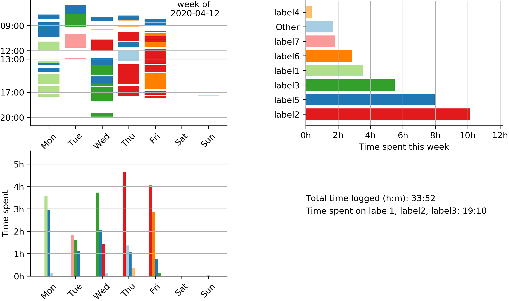

# task_timer
A python GUI of a minimal timer that logs tasks with selected label to csv files. It includes a button that shows logged time this week. Additionally, a jupter notebook is provided for more detailed analysis on all logged data. The GUI can be run as a python script, or with a few steps one can create an executable using pyinstaller.

#### Timer behavior:
- The timer counts down from 25 minutes (25:00).
- From 01:00 to 00:00, the background turns red incrementally.
- At time 00:00, the timer resets to 25:00, continuing counting down.
- The stop button resets the timer to 25:00
- The task, label, start-time, date, and time spent are logged when either time equals 00:00 or stop is pressed;

Screenshot of the task timer| The visualization of weekly data
:-------------------------:|:-------------------------:
|      

#### How to use the python script
I currently have the `task_timer` set up to log my time in a folder away from this repository. Step 1 fixes this for you.

Step 1, I recommend forking this repository and change one of two lines in `task_timer.py`:

`self.log_elsewhere = False`

or

`self.log_dir = 'insert-your-desired-logfile-location'`

Step 2, run `task_timer.py` in python3.

#### How to create an executable
With pyinstaller this script can be turned into an executable that is standalone. Because the plotting code requires a few common python packages (such as pandas), the executable becomes rather big (~200Mb). Pyinstaller is a bit finicky in the package versions it takes in so I recommend using pythons virtual environment package.

Step 1. Create a virtual environmennt in the `task_timer` folder according to https://docs.python.org/3/tutorial/venv.html.

Step 2. Run `pip install -r requirements.txt`, this installs the pyinstaller-compatible package versions. Especially numpy and matplotlib versions can cause trouble.

Step 3. Run `pyinstaller task_timer.spec`. This will create the executable in the `dist` folder.

#### How to customize drop down labels
The labels in the drop-down menu are saved in the `label_options.json` file in the  `log_files` folder. If you type in a new label in the `task_timer` it will be added to `label_options.json`. To remove unwanted labels, delete them in the `.json` file.

Similarly, in the visualization there is a printout `Time spent on label1, label2, label3:`. To customize this, adjust the desired labels to sum in `work_labels.json` (agian, in the log_file folder). 
