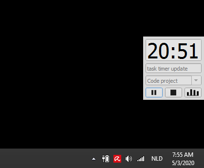

# Task Timer
A minimal timer that logs tasks per label to csv files (one per week). The Jupyter notebook can be used to look at some data aggregation and visualization.

Timer behavior:
- The timer counts down from 25 minutes (25:00).
- From 01:00 to 00:00, the background turns red incrementally.
- At time 00:00, the timer resets to 25:00, continuing counting down.
- The stop button resets the timer to 25:00
- The task, label, start-time, date, and time spent are logged when either time equals 00:00 or stop is pressed

Screenshot of the Task Timer| The jupyter notebook visualization of weekly data
:-------------------------:|:-------------------------:
|      

## Background
The timer GUI is based on PyQt5. The executable version is built using pyinstaller, though it currently takes up over 30 Mb (and needs to be in the same folder as the Task_timer.py file?).
